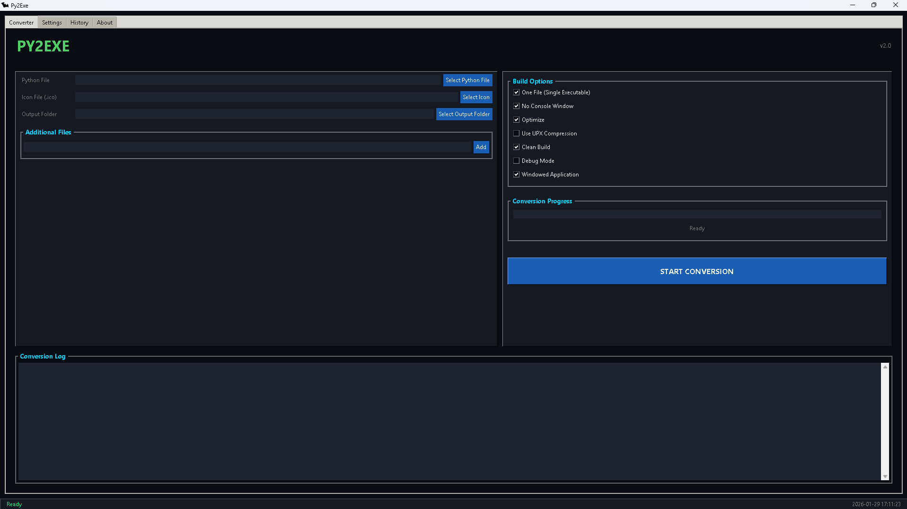

# Pytoexe – Python to EXE Converter

Python to EXE Converter for Windows (Standalone Application)

---

## Screenshots

> Modern, clean, and easy to use interface.

  

---

## Download

Download the latest version:

👉 **[Download pytoexe_v2.0.zip](pytoexe_v2.0.zip)**

No installation required. Extract and run.

---

## Features

- Convert Python (.py) files to Windows (.exe)
- Modern graphical user interface
- Real-time conversion progress tracking
- Conversion history log
- Custom executable icon support
- Background music with volume control
- Multiple build options
- No Python installation required on target computer

---

## How to Use

1. Download the latest release
2. Extract the ZIP file
3. Run `pytoexe.exe`
4. Select your Python file
5. Choose conversion options
6. Click **START CONVERSION**
7. Retrieve the generated executable file

---

## Conversion Options

- One File – Create a single executable (recommended)
- No Console – Hide command window (for GUI applications)
- Custom Icon – Use a custom `.ico` file
- UPX Compression – Reduce executable size
- Clean Build – Remove temporary build files
- Windowed Mode – Run as a windowed application

---

## System Requirements

- Operating System: Windows 7 / 8 / 10 / 11 (64-bit)
- Storage: Minimum 200 MB free space
- Memory: Minimum 2 GB RAM

Python installation is not required.

---

## Files Included

- `pytoexe.exe` – Main application
- `bat.ico` – Default icon
- `temp_audio.mp3` – Background music (optional)

---

## Troubleshooting

**Antivirus warning**  
Some antivirus software may detect the application as suspicious due to executable packaging. This is a false positive. Add the application to your antivirus exclusion list.

**Application does not start**  
Run as administrator and ensure all files were extracted properly.

**Conversion fails**  
Check that the Python script contains no errors and required dependencies are installed.

**Missing DLL error**  
Install the latest Microsoft Visual C++ Redistributable.

---

## Frequently Asked Questions

**Do I need Python installed?**  
No. This application is fully standalone.

**Can I convert multiple files at once?**  
No. One file at a time is supported for stability.

**Where is the output file saved?**  
In the output folder selected during conversion.

**How do I disable background music?**  
Open the Settings tab and disable background music.

**Is my code uploaded anywhere?**  
No. All processing is done locally.

---

## Support

For bug reports or feature requests:

- Review the troubleshooting section
- Open an issue on GitHub
- Include detailed error information and logs

---

## License

MIT License

---

## Credits

Developed by 0-bytee  
Built using PyInstaller, Tkinter, and pygame

---

## Version History

### v2.0

- Improved conversion stability
- Real-time progress tracking
- Enhanced user interface
- Settings and history system
- Audio control support
